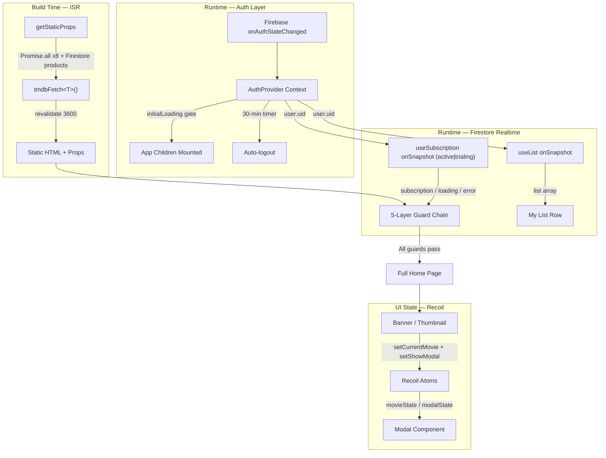

[English](README.md) | [繁體中文](README.zh-TW.md)

# TMDB Streaming Architecture — A Production-Grade Frontend Reference Implementation

This project is a **technical reference implementation** for a streaming media frontend architecture. It focuses on resolving **state dependencies across multiple asynchronous data flows** and handling **boundary edge cases**. The architecture demonstrates how to build a **predictable, fault-tolerant, and defensively designed** state management system across **Firebase Auth** (authentication), **Stripe** (subscription billing), and the **TMDB API** (media data).

- **Live Reference Deployment**: [stream.tinahu.dev](https://stream.tinahu.dev/)
- **Test Credentials**: Email `demo@tinahu.dev` / Password `Demo1234!` (account pre-activated with a test subscription)

[](https://github.com/yuting813/TMDB-Streaming-Architecture/actions)


---

## Architectural Decisions

### 1. Guarded Render Chain

In asynchronous data flows (e.g., Firebase Auth state must be confirmed before querying Firestore for subscription plans), deeply nested `if-else` blocks — or a single monolithic condition trying to cover everything (`if (auth && sub && !loading)`) — quickly become unmaintainable.

**Decision**: `pages/index.tsx` abandons nested conditionals in favor of a strict **early-return guard chain** (guard clauses). Each `if` acts as an independent checkpoint responsible for exactly one boundary:

```tsx
// Layer 1 — Loading guard: Full-screen spinner while any data source is loading
if (authLoading || subscriptionLoading) return <Loader />;

// Layer 2 — Auth guard: Blocks mounting for unauthenticated users
// (Redirection is handled inside useAuth's onAuthStateChanged callback)
if (!user) return null;

// Layer 3 — Error handling: Fallback UI with a "reload" button on Firestore connection errors
if (subscriptionError) return <ErrorState />;

// Layer 4 — Access guard: Users without an active subscription are routed to the plans page
if (!subscription) return <Plans products={products} />;

// Layer 5 — All guards passed: Mount the core content
return <MainContent />;
```

**Payoff**: Adding a new edge case in the future only requires inserting one more `if` statement—eliminating the risk of regressions in existing guards.

---

### 2. `initialLoading` — Eradicating FOUC and Screen Flicker

Firebase authentication resolution is asynchronous. Before the SDK confirms the user's state, `user` is temporarily `null`. If a route guard fires prematurely, an already-logged-in user experiences a jarring "logged-out screen → home page" flash (Flash of Unauthenticated Content, FOUC).

**Decision**: `useAuth` implements a firm `initialLoading` timing lock, blocking children from rendering until the first `onAuthStateChanged` callback resolves:

```tsx
<AuthContext.Provider value={memoedValue}>
	{initialLoading ? (
		<div className='flex h-screen w-screen items-center justify-center bg-black'>
			<Loader color='fill-red-600' />
		</div>
	) : (
		children
	)}
</AuthContext.Provider>
```

**Auto-logout timer**: `useAuth` also sets a 30-minute `setTimeout` after login, executing `logout()` when it expires to force-end the session. This timer is cleared via a `useEffect` cleanup function upon manual logout or component unmount, preventing dangling callbacks.

---

### 3. API Defense Layer: `tmdbFetch`'s Three Lines of Defense

Components are strictly prohibited from calling native `fetch()` directly. All network requests are routed through `utils/request.ts`, which enforces three layers of protection:

1. **Request Deduplication (In-flight Cache)**: `getStaticProps` fires 8 parallel TMDB requests alongside a Firestore product query, and different route pages may share duplicate URLs. A module-level `Map<string, Promise>` cache returns the exact same Promise instance for a repeated URL, effectively blocking duplicate traffic. On rejection, the cache entry is cleared to allow subsequent retries.
2. **Build-Hang Protection (Timeout)**: A built-in `AbortController` enforces an 8-second timeout, preventing an unstable TMDB connection from hanging the Next.js build process indefinitely.
3. **Safe Signal Aggregation (`mergeAbortSignals`)**: Gracefully reconciles a "network timeout" event with a "component unmount" event—either can cleanly terminate the underlying `fetch`. After an abort, listeners on both original signals are synchronously removed via `removeEventListener`, substantially reducing the risk of React memory leaks and dangling async callbacks. (Hand-written as a Safari polyfill, since older Safari versions lack support for `AbortSignal.any()`).

---

### 4. Modal Race Condition Defense (Stale Response Ignore)

When a user rapidly clicks through the movie list, an earlier `fetch` result can arrive after a new modal has already been rendered. This overwrites the new state with stale data, causing visual corruption (a race condition).

**Decision**: A closure variable `active` inside `useEffect` tracks the component's mount lifecycle. Before applying any state updates, the `fetchMovie` async function checks the `active` flag. If the modal has closed or switched by the time the response arrives, the stale payload is deliberately discarded:

```tsx
useEffect(() => {
  if (!movie) return;
  let active = true;

  async function fetchMovie() {
    const data = await tmdbFetch(...).catch(() => null);
    if (!active) return; // Discard stale results after unmount, preventing state pollution
    setTrailer(key);
    setGenres(data?.genres || []);
  }

  fetchMovie();
  return () => { active = false; };
}, [movie]);
```

This pattern defends against both React's memory-leak warnings and UI state pollution originating from out-of-order asynchronous responses.

---

### 5. Dual-Track State Architecture: ISR + Firestore

Movie catalog data and user profile data update at fundamentally different frequencies. Forcing both onto the same data layer inevitably leads to state desynchronization. This project splits the data flow by characteristic:

| Track | Mechanism | Trigger | Single Source of Truth (SSOT) |
| --- | --- | --- | --- |
| Movie Catalog Data | Next.js ISR (`getStaticProps` + `revalidate: 3600`) | Build time + hourly background revalidation | TMDB API |
| User Profile Data | Firestore `onSnapshot` (`useList` / `useSubscription`) | Push-based, on any DB change | Firestore |

**Decision**: For the user's "My List", rather than storing state in Redux/Recoil and asynchronously pushing it to the backend, Firestore is treated directly as the SSOT. Components only trigger writes and passively receive changes via `onSnapshot`. This entirely eliminates the risk of state inconsistency caused by the UI state getting ahead of the backend.

**Subscription query condition**: `useSubscription` queries using `where('status', 'in', ['active', 'trialing'])`, meaning a single guard effortlessly covers both standard active subscriptions and users in their trial period.

**Error fallback**: On a TMDB request failure, the `getStaticProps` catch block returns an empty array and shortens `revalidate` to 60 seconds. This ensures a failed build retries as soon as possible.

---

### 6. State Selection: Context vs. Recoil (Decoupled by Data Flow)

- **Auth (React Context)**: Authentication state sits at the top of the component tree and mutates infrequently. `useAuth` encapsulates the complete Firebase subscription lifecycle and the auto-logout timer, utilizing `useMemo` to block unnecessary render noise.

- **UI State (Recoil Atom)**: Using Context for the Banner, Thumbnail, and Modal would trigger widespread, unnecessary re-renders. This system leverages Recoil atoms as a lightweight publish/subscribe event bus, fully decoupling components. Clicking a Thumbnail only requires `setCurrentMovie(movie)`, completely bypassing prop drilling.

  **Write-Side Isolation**: `Thumbnail` utilizes `useSetRecoilState` (a write-only setter) rather than `useRecoilState`. Because the Thumbnail only ever writes and never reads this state, `useSetRecoilState` ensures no thumbnail component is registered as a subscriber to the Recoil atom. This elegantly bypasses the O(N) cascading re-render problem, where clicking one thumbnail would otherwise force every thumbnail on the screen to re-render. The `Home` page itself also holds no reference to `modalState`, keeping page-level components entirely outside the UI interaction state's subscription chain.

---

## System Architecture



---

## Edge Cases and System Stability

- **Image Loading State Management**: Every image component tracks three distinct phases: loading (a gradient `animate-pulse` skeleton to prevent layout shift/CLS), success (an `opacity-100` fade-in transition to avoid harsh flashes), and failure (a local `/fallback-image.webp` to prevent broken image icons). `onError` triggers `setIsLoaded(true)` so the skeleton unmounts immediately when the fallback appears, layering an "Image unavailable" overlay on top to clearly communicate the failure state to the user. Implemented in `Thumbnail.tsx` and `Modal.tsx`.
- **Tamper-Resistant Route Allowlist**: `Object.freeze(['/login', '/signup', '/reset', '/pricing'])` freezes the constant, guaranteeing the auth route guard's reference list cannot be accidentally mutated. As an engineering discipline, this surfaces misuses early in development (via `TypeError`), adhering to a "fail-fast over fail-safe" defensive philosophy.
- **Modal Accessibility Focus Trap**: When a modal opens, `document.activeElement` is preserved in `triggerRef`. A `keydown` listener forces Tab focus to cycle strictly among all focusable elements inside the modal, supporting ESC to close and Space to toggle playback. Upon closing, focus is synchronously restored to the original trigger element via `triggerRef.current?.focus()`, perfectly aligning with WCAG accessibility guidelines.
- **Jest Unit Tests**: Tests are focused heavily on `useSubscription`, utilizing a mocked Firestore to validate 6 critical boundary state transitions: `null user`, `empty list`, `onSnapshot error`, `loading`, `subscription active`, and `subscription inactive`. This rigorously validates code robustness under complex asynchronous conditions.

---

## Project Structure

```text
pages/          # Route entry points (kept minimal, complexity delegated to hooks)
components/     # UI presentation layer (no direct API calls)
hooks/          # Defensive state management logic (useAuth / useSubscription / useList)
atoms/          # Atomic Recoil state
utils/          # API forwarding interface and network-layer defenses
constants/      # Shared configuration constants
types/          # TypeScript type definitions
```

## Firestore Schema and Security Rules

### 1. Data Model

```text
customers/
  {uid}/
    subscriptions/
      {subscriptionId} → { status, current_period_start, current_period_end }
    payments/
      {paymentId} → { ... }
    checkout_sessions/
      {sessionId} → { ... }   ← The only sub-collection clients are allowed to write to
    myList/
      {movieId} → { id, title, poster_path, backdrop_path, ... }

products/
  {productId}/
    prices/
      {priceId} → { unit_amount, currency, interval }
    tax_rates/
      {taxRateId} → { ... }
```

### 2. Security Rule Design

This project's `firestore.rules` meticulously separates read/write access by functional boundary:

- **User Data Isolation**: `customers/{uid}` and its sub-collections are tightly restricted to `request.auth.uid == uid`, ensuring only the authenticated owner of that specific credential can access the data.
- **Read-Only Sensitive Data**: A user's subscription records (`subscriptions`) and payment records (`payments`) strictly grant `read` access in the security rules. Clients cannot directly modify subscription states—updates flow securely through the Stripe Webhook (Stripe Firebase Extension) on the backend, structurally preventing client-side tampering.
- **Checkout Sessions (Read/Write)**: `checkout_sessions` is the *only* sub-collection clients are permitted to write to, as the Stripe Checkout flow requires the client to instantiate a session document to initiate payment. This exemplifies a minimal write-surface design.
- **Public Read-Only Plans**: Plan metadata (`products/**`, including `prices` and `tax_rates`) is configured to be publicly readable (`allow read: if true`) and explicitly blocks any client-side writes.

---

## Author and Engineering Philosophy

Drawing from a background in risk management—particularly a sensitivity to anticipating extreme scenarios—I apply these principles to software development, focusing heavily on **defensive frontend engineering** and codebase resilience.

This project demonstrates how that philosophy applies to a complex asynchronous system: whether it's the streaming media three-state state machine, centralized AbortSignal cleanup compatible with older Safari versions, the 30-minute session auto-expiry guard, or the multi-layer route guard chain. Every architectural decision is engineered to keep the user experience and system state as predictable and consistent as possible, even when underlying APIs or networks become unstable.

- **Website**: [tinahu.dev](https://www.tinahu.dev/)
- **GitHub**: [yuting813](https://github.com/yuting813)
- **Email**: [tinahuu321@gmail.com](mailto:tinahuu321@gmail.com)

> **Educational Use Disclaimer**
> This project is solely for personal technical demonstration and educational purposes. It is **not** a commercial product and is not affiliated with any streaming media service. Movie data is sourced via the public [TMDB API](https://www.themoviedb.org/).
