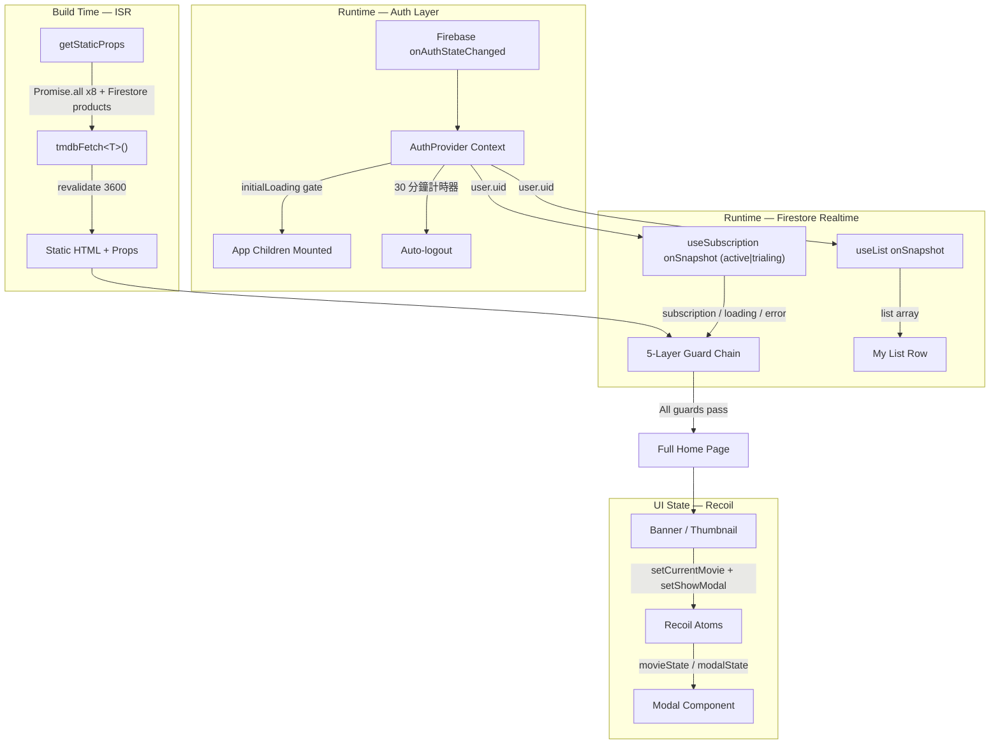

[English](README.md) | [繁體中文](README.zh-TW.md)

# TMDB Streaming Architecture — 穩健生產級前端參考實作

本專案為串流媒體前端架構的**技術參考實作**，專注於解決**多重非同步資料流的狀態依賴**與**邊界極端情境（Edge Cases）**。本架構展示了如何在 **Firebase Auth（身份認證）**、**Stripe（金流訂閱）** 與 **TMDB（媒體資料）** 之間，建立一個**可預測、高容錯且具備防禦性設計（Defensive Design）**的狀態管理系統。

- **線上參考部署**: [stream.tinahu.dev](https://stream.tinahu.dev/)
- **測試憑證**：Email `demo@tinahu.dev` / Password `Demo1234!`（帳號已預先開通測試訂閱）

[](https://github.com/yuting813/TMDB-Streaming-Architecture/actions)


---

## 核心架構與工程決策 (Architecture Decisions)

### 1. Guarded Render Chain（防禦性渲染鏈）

在非同步的資料流中（例如：必須先確認 Firebase Auth 狀態，才能向 Firestore 查詢訂閱方案），如果使用深層巢狀的 `if-else`，或是把條件全塞進同一個判斷式（例如 `if (auth && sub && !loading)`），將導致邏輯極度難以維護。

**設計決策**：在 `pages/index.tsx` 中捨棄巢狀結構，改採嚴格的 **Early Return（提早回傳）防護鏈**（又稱 Guard Clauses），讓每一層 `if` 就像獨立的安全檢查哨，只專注於單一防禦邊界：

```tsx
// 第 1 層 — Loading 防護：任一資料來源載入中，全螢幕 Spinner
if (authLoading || subscriptionLoading) return <Loader />;

// 第 2 層 — Auth 防護：未登入者阻擋掛載
// （redirect 由 useAuth 內部的 onAuthStateChanged callback 負責執行）
if (!user) return null;

// 第 3 層 — 錯誤處理：Firestore 連線異常時顯示含「重新載入」按鈕的 fallback UI
if (subscriptionError) return <ErrorState />;

// 第 4 層 — 權限防護：無有效訂閱者，鎖定於訂閱方案頁
if (!subscription) return <Plans products={products} />;

// 第 5 層 — 全部通過後掛載主核心元件
return <MainContent />;
```

優勢在於：未來若需新增邊界情境，只需插入一層 `if` 即可，不會引發回歸錯誤（Regression Bug）。

---

### 2. `initialLoading` — FOUC 與畫面閃動的根本解法

Firebase 驗證為非同步回調。在 SDK 確認使用者狀態前，`user` 會暫時呈現 `null`。若此時觸發路由守衛，已登入的用戶會經歷「未登入畫面 → 首頁」的嚴重閃動（Flash of Unauthenticated Content, FOUC）。

**設計決策**：在 `useAuth` 實作堅固的 `initialLoading` 時序鎖。在第一次 `onAuthStateChanged` 回調確認前，強制攔截 children 渲染：

```tsx
<AuthContext.Provider value={memoedValue}>
  {initialLoading ? (
    <div className="flex h-screen w-screen items-center justify-center bg-black">
      <Loader color="fill-red-600" />
    </div>
  ) : (
    children
  )}
</AuthContext.Provider>
```

**自動登出計時器**：`useAuth` 同時在用戶登入後設定 30 分鐘的 `setTimeout`，到期後呼叫 `logout()` 強制結束 Session。計時器透過 `useEffect` cleanup 在用戶主動登出或元件卸載時同步清除，防止懸空回調（Dangling Callback）。

---

### 3. API Defense Layer（請求防禦層）：`tmdbFetch` 的三道防線

嚴禁在元件內直接呼叫原生 `fetch()`。所有網路請求統一透過 `utils/request.ts` 轉發，並落實三大防護：

1. **請求去重（Request Deduplication / In-flight Cache）**：`getStaticProps` 同時並行 8 個 TMDB 請求與 Firestore 產品查詢，不同路由頁面間可能含有重複 URL。透過模組級別的 `Map<string, Promise>` 快取，相同 URL 返回同一個 Promise 實體，阻斷重複流量。Promise reject 時自動清除 cache entry，允許重試。
2. **Build 卡死防護（Timeout）**：內建 `AbortController` 賦予 8 秒 timeout，避免 TMDB 網路不穩導致 Next.js build 無限掛起。
3. **安全的中斷聚合（`mergeAbortSignals`）**：完美收斂「網路 Timeout 事件」與「Component 卸載事件」。任何一方發送 Abort 皆可乾淨砍斷底層 `fetch`；abort 後同步執行 `removeEventListener` 清除兩個原始 signal 的監聽器，根除 React Memory Leak 與懸空非同步回調。（手刻實作，作為 Safari 的 polyfill——較舊的 Safari 版本不支援 `AbortSignal.any()`。）

---

### 4. Modal 的競態條件防禦（Stale Response Ignore）

當使用者在影片列表快速連點時，舊的 `fetch` 結果可能在新的 Modal 已渲染後才回來，進而覆蓋狀態造成畫面錯亂（Race Condition）。

**設計決策**：在 `useEffect` 內宣告閉包變數 `active` 追蹤元件的掛載生命週期。`fetchMovie` 非同步函式在套用任何狀態更新前，都會先確認 `active` 旗標——當回應抵達時若 Modal 已關閉或切換，過期的 Payload 會被主動丟棄：

```tsx
useEffect(() => {
  if (!movie) return;
  let active = true;

  async function fetchMovie() {
    const data = await tmdbFetch(...).catch(() => null);
    if (!active) return; // 元件卸載時丟棄 stale 結果，防止狀態污染
    setTrailer(key);
    setGenres(data?.genres || []);
  }

  fetchMovie();
  return () => { active = false; };
}, [movie]);
```

此設計同時防禦 React 的 Memory Leak 警告，以及非同步回應順序錯亂造成的 UI 狀態污染。

---

### 5. Dual-Track State Architecture（雙軌狀態架構）：ISR + Firestore

電影清單與用戶個人資料的更新頻率截然不同，強制混用同一個資料層將導致狀態脫鉤。本專案將資料流依據特性拆分：

| 軌道         | 機制                                                   | 觸發時機                          | Single Source of Truth (SSOT) |
| ------------ | ------------------------------------------------------ | --------------------------------- | ----------------------------- |
| 電影分類資料 | Next.js ISR (`getStaticProps` + `revalidate: 3600`)    | Build Time + 每小時背景增量       | TMDB API                      |
| 用戶個人資料 | Firestore `onSnapshot` (`useList` / `useSubscription`) | 任何 DB 變化即時推送 (Push-based) | Firestore                     |

**設計決策**：針對使用者的「我的片單」，捨棄將狀態儲存於 Redux/Recoil 後再非同步推上後端的傳統作法，改將 Firestore 直接當作 SSOT。元件僅負責觸發寫入，並依賴 `onSnapshot` 被動接收變化，徹底杜絕了 UI 先行導致的狀態不一致風險。

**訂閱查詢條件**：`useSubscription` 以 `where('status', 'in', ['active', 'trialing'])` 查詢，一個守衛同時涵蓋標準有效訂閱與試用期（Trial Period）用戶。

**錯誤 Fallback**：`getStaticProps` 的 catch 區塊在 TMDB 請求失敗時會回傳空陣列，並縮短 `revalidate` 至 60 秒，確保 build 失敗後盡快觸發重建重試。

---

### 6. 狀態選型：Context vs Recoil（按資料流向解耦）

- **Auth (React Context)**：認證狀態是樹頂端的依賴，變更頻率低。`useAuth` 封裝完整的 Firebase 訂閱生命週期與自動登出計時器防護，並用 `useMemo` 阻擋渲染噪音。

- **UI 狀態 (Recoil Atom)**：Banner、Thumbnail 與 Modal 若使用 Context 會引發大範圍的不必要重渲染。本系統使用 Recoil atom 作為輕量的發布/訂閱（Publish/Subscribe）事件匯流排，讓元件完全解耦——Thumbnail 點擊後僅需 `setCurrentMovie(movie)`，無需任何 Prop Drilling。

  **寫入端隔離**：`Thumbnail` 採用 `useSetRecoilState`（純寫入 Setter）而非 `useRecoilState`。因為 Thumbnail 只需要發送狀態、從不讀取，使用 `useSetRecoilState` 可確保所有縮圖元件都不會被登記為 Recoil atom 的訂閱者，徹底消除「點擊任意縮圖導致畫面上所有縮圖一同重渲染」的 O(N) 連鎖渲染問題。`Home` 頁面本身也不持有任何 `modalState` 的參照，確保頁面層級元件完全脫離 UI 互動狀態的訂閱鏈。

---

## 系統架構圖



---

## 邊界情境防護與系統穩定性

- **圖片載入狀態管理**：每個圖片元件皆維護三個階段——載入中（以漸層 `animate-pulse` Skeleton 防止版面移位 CLS）、成功（`opacity-100` 淡入 transition 避免閃爍）、失敗（顯示本地 `/fallback-image.webp` 以防破圖）。同時利用 `onError` 觸發 `setIsLoaded(true)`，確保 fallback 圖片出現時能即時卸載 Skeleton。另外在 fallback 之上疊加 `"Image unavailable"` 錯誤提示覆蓋層，明確傳達失敗狀態。此機制已實作於 `Thumbnail.tsx` 與 `Modal.tsx`。
- **防篡改的路由白名單**：透過 `Object.freeze(['/login', '/signup', '/reset', '/pricing'])` 凍結常數，確保 Auth 路由守衛的判斷基準不會被意外修改。作為一種工程紀律，此舉能在開發階段提早攔截誤用（觸發 TypeError），落實「防呆大於防駭」的防禦性精神。
- **Modal 無障礙 Focus Trap**：Modal 開啟時，將 `document.activeElement` 存入 `triggerRef`。透過 `keydown` 監聽器強制 Tab 鍵在 Modal 內所有可聚焦元素間循環，並支援 ESC 關閉、Space 切換播放。Modal 關閉時，透過 `triggerRef.current?.focus()` 同步將焦點還原至原始觸發元素，符合 WCAG 可及性標準。
- **Jest 單元測試**：聚焦於 `useSubscription`，使用 Mock Firestore 測試 6 種邊界狀態切換：`null user`、`empty list`、`onSnapshot error`、`loading`、`subscription active`、`subscription inactive`，嚴格驗證非同步情境下的程式碼強韌度。

---

## 專案結構

```
pages/          # 路由入口（保持邏輯極簡化，將複雜度委派至 Hooks）
components/     # UI 呈現層（不處理 API 直接呼叫）
hooks/          # 防禦性狀態管理邏輯（useAuth / useSubscription / useList）
atoms/          # 原子化 Recoil 狀態
utils/          # API 轉發介面與網路層防禦實作
constants/      # 共用設定常數
types/          # TypeScript 型別定義
```

## Firestore 資料結構與安全規則

### 1. 資料模型

```
customers/
  {uid}/
    subscriptions/
      {subscriptionId} → { status, current_period_start, current_period_end }
    payments/
      {paymentId} → { ... }
    checkout_sessions/
      {sessionId} → { ... }   ← 唯一允許客戶端寫入的子集合
    myList/
      {movieId} → { id, title, poster_path, backdrop_path, ... }

products/
  {productId}/
    prices/
      {priceId} → { unit_amount, currency, interval }
    tax_rates/
      {taxRateId} → { ... }
```

### 2. 安全規則 (Security Rules) 設計

本專案的 `firestore.rules` 依功能需求區分讀寫權限：

- **用戶資料隔離**：`customers/{uid}` 及其子集合限制為 `request.auth.uid == uid`，僅允許持有對應憑證的登入用戶本人進行存取。
- **敏感資料唯讀**：用戶的訂閱記錄（`subscriptions`）與付款記錄（`payments`）在安全規則中僅開放 `read` 權限。用戶端無法直接變更訂閱狀態，狀態更新需經由 Stripe Webhook (Stripe Firebase Extension) 於後端處理，防範前端資料篡改。
- **Checkout Sessions（讀寫）**：`checkout_sessions` 是唯一允許客戶端寫入的子集合，因為 Stripe Checkout 流程需要由客戶端建立 Session 文件以啟動支付。這是最小化的寫入面（Minimal Write Surface）設計。
- **公開方案唯讀**：方案元資料（`products/**`，含 `prices` 與 `tax_rates`）設為公開可讀（`allow read: if true`），且禁止任何用戶端寫入。

---

## 作者與工程哲學

結合過去在風險管理中對「極端情境預判」的敏感度，我將這份思維帶入軟體開發，專注於**防禦性前端工程**與程式庫韌性。

本專案展示了如何將此原則應用於複雜的非同步系統：不論是串流媒體的三態狀態機、與舊版 Safari 相容的 AbortSignal 集中清理、30 分鐘 Session 自動過期防護，還是多層路由防護鏈，皆力求在底層 API 或網路環境不穩定時，確保使用者體驗與系統狀態的完美一致。

- **Website**: [tinahu.dev](https://www.tinahu.dev/)
- **GitHub**: [yuting813](https://github.com/yuting813)
- **Email**: [tinahuu321@gmail.com](mailto:tinahuu321@gmail.com)

> **教育用途免責聲明**
> 本專案僅供個人技術證明與教育用途，**非**商業產品，且與任何串流媒體服務無關。電影資料皆來自 [TMDB API](https://www.themoviedb.org/)
